# Important Notes
- this is an archive of our final project. I'm saving this b/c I'm sure our files will be deleted off whatever server it's stored on
- missing googletest submodule, will have to add that manually for tests to compile/run
- think i included some generated files that don't need to be there for function, but I don't think it matters that much. just run cmake again on your end

# Battle League
 > Authors: [Jude Boura](https://github.com/JudeBou-ra), [Connor ***](https://github.com/connory94), [Alston Huang](https://github.com/ahuan190-lab), [David Pham](https://github.com/dpham125)

## Project Description
### Why is it important or interesting to you?
   
   Growing up with technology and the internet exposed us to many forms of media, and games are simply part of those media that we had consumed which turned out to be a significant part of our lives. We found a common interest, which was that while we had been the consumers of video games, we had not developed one ourselves yet and hence: Battle League. The freedom of developing an RPG is very interesting, as you are given many options to choose from:
   - A story that the player chooses for themselves, like a visual novel
   - A progression fantasy where the player grows in power while battling increasingly difficult enemies
   - An exploration game with hidden areas and secrets to unveil about the world
   - Multiple characters to play as
   - And much more

   Though Battle League is mostly a progression fantasy, we could potentially add more features that are from the other subgenres of an RPG, which makes it even more fun to play with.
### What languages/tools/technologies do you plan to use? (This list may change over the course of the project)
   
   The language we're going to use is C++, as it's the main language people learns before this course. The tools or application we are going to be working is VScode/terminal, and the complier would be g++, and to create the project we build the sytem through cmake, make. Working with GitHub we can push our part of the project into GitHub to test if files we each made working successfully together. We can test parts of the project with manual testing or with unit testing, depending on what needs to be tested at the time. And the techologies to help the process of creating our project could be from database, but later on we would switch to other techologies to use as well as new tools to make sure the project runs the way we want to.
   
### What will be the input/output of your project?

- The game will be terminal-based, with the player making choices by entering prompts into the terminal, and the game displaying their actions through text-based menus and basic hand-drawn ASCII art. The player will be prompted to pick through two routes to traverse through each area, and each route leads a to a different adventure with the same end area. you can be prompted with two descriptions of seperate areas within the same biome and the user will select left or right to decide.

- menus/scenes will be formatted in a way that more closely resembles modern game UI instead of using basic text for options. The visuals for the game won't be entirely left to the imagination.  The player will be able to either run or fight enemies with an option for potions and healing items in the menu aswell. There will also be a menu where you can select the weapon you want to use, that matches with your class (described below).
 
### What are the features that the project provides?
 
- Our RPG game provides extensive customization, allowing players to choose from a variety of playable characters, who each have different strengths and weaknesses. To list them, we will have a knight class with extreme proficiency with swords allowing a 15% increase in damage but also has a flaw of not running from a battle, while other classes can retreat to leave a losing fight and heal, knights must face their opponent no matter what. We also have an assasin class, which wields daggers and starts with a high speed stat which is 20 points above the base amount (30) but their damage is much lower since the assassin class can only wield daggers which are lower damaging weapons. Next we have a tank class which gives you a boosted defense stat and starts you with extra hitpoints, but also decreases your damage by 10% and base speed lowered from 30 to 20. But with this attack debuff, you are given a stronger resistance to crits, which nullify 25% of the incoming damage. And finally we have a Mage. The mage class is extremely unique to the others becuase they are not allowed to use a weapon, but are forced to use staffs and spells. Utilizing these spells gives you a chance to apply status affects (sleep, paralyze, burn, poison) onto enemies. So each class has different strengths and weaknesses and depends on the user to determine the play style he wants.

- In terms of combat, it will have a turn based approach with the player attacking first and then the individual player's speed stat carry on from there. Players will randomly encounter enemies on their way to the boss of that area. They may run into, spiders, goblins, or even golems depending on which area you are in and are expected to either fight them or run away. There will be 4 main areas (Starter Forest, Tremorous Caves, Desert of Death, and The King's Land) with multiple paths and enemies along them. The King's Land is where the final boss appears and lives at the top of the castle. The Tremorous Caves also have a chance to shake during battles which does damage 80% of the time but can also do nothing. For example, if you move to a new path in the caves, the cave will shake and you have a chance to take damage. The Starter Forest is filled with weak starter enemies that are meant to teach you the game with an end boss that serves as a tutorial. And finally, the Desert of Death is an area that has desert dryness damage that persists through the entire area. The longer you stay the faster the desert widels you down. There is also a critical strike chance that is applied to all weapons. Players will also be able to obtain coins from defeating both bosses and enemies along the way. Most enemies will drop coins that you can spend at shops for items like potions that boost health, or items that can increase defense, attack, or speed. 

- Additionally, if a player is defeated, they are forced to restart from the beginning and are met with a game over message. Finally after defeating the final boss the player will be given a message saying the game is over and they are welcome to restart the game afterwards

## User Interface Specification
### Navigation Diagram

#### Start Screen
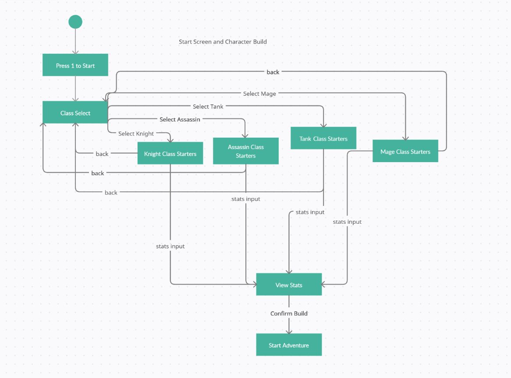
This shows the flow of starting our game and the character creation process. It highlights each step and shows how different options lead to their respective screens. It also shows the number of options the player has at that current step.

#### Map Traversal
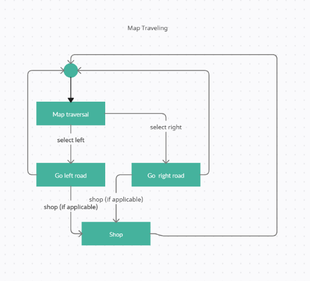

This illustrates the system of moving through the map, and how selecting certain choices lead to different options.

#### Battle Interaction
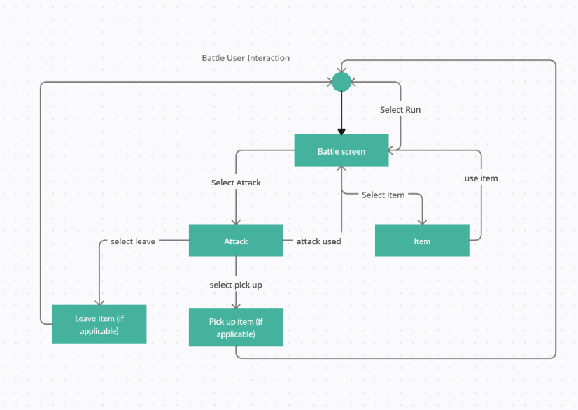
This shows the flow of battle and the options you have during the fight. It shows how each selected option changes the game for the user and leads to different screens.

### Screen Layouts

#### Start Menu
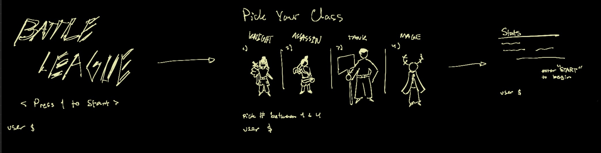
Generally, Our screens will be drawn out using text in the terminal, For the start menus, the game will prompt the player to input numbers for the actions they want to take, and the game will transition to different screens or take different actions accordingly. This is how starting the game and character creation will be handled.

#### Map Traversal
Similar to the start menu, choices will be made by entering numbers into the terminal. Descriptions of your choices and simple visuals made using images converted to ASCII characters are provided as well.

#### Battle Interaction
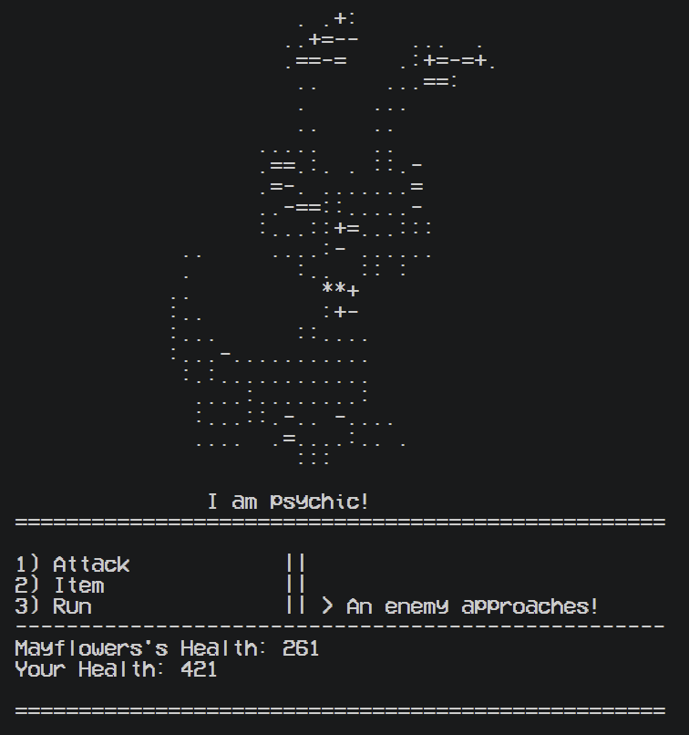

Again, the user will take actions by entering a valid number. The available actions and a log of previous actions taken will be shown on the bottom of the screen, and the current health of the enemy will be shown above the actions. 

## Re-Designed Class Diagram

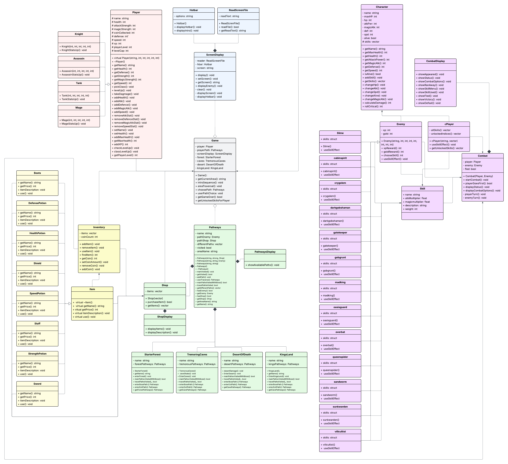

The user is going to first going to be sent to a logo screen that displays the name of the game and a prompt to enter their name, then they will be taken to the screen for class creation with the four classes, see the stats of them and the ability to rebuild one if they want to. They are then taken to the spot where they will know where they, the location of the user in the game, after loading into the location they are able to move along the paths in any other you want but you can't access the boss path. And at each path there will be two things happen, first is there's an enemy and it takes you to the enemy character tab then in to the combat phase where the battle begins and the user is able to fight with their player stats lines attack or run away, and the combat system also tells the user of what the damage they have taken and have done to the enemy, when an enemy is defeated they drop coins that can be picked up and used at shops. The path could also contain a shop instead of an enemy, which are places where user can buy items, or just leave to the other paths or bosses. Then comes to last and most important part, which is the player themself and their inventory, as they can use items to improve themself, or remove item to gain more powerful item, and also gain weapon that gives the player more attack damage. Along this journey the player levels up to gain more powerful overtime, and the more they play the more powerful the enemy gets with different items to be gain from shops or dropped by enemies.

### Solid Principles

In this class diagram one change that was based on SOLID was breaking our larger more complex classes into smaller single responsibility classes which aligns with the S in SOLID. Our specific application falls under the Location class, where we broke it up into the 4 Areas in our game. The larger class was broken up into a Starter Forest class, a Desert of Death class, a Tremorous Caves class, and finally a Kinds Land class. We also broke up the Character class into 4 other classes that represent the role the player chose. So the Character class got broken up into a tank class, an assassin class, a mage class, and a knight class. This improves the coding process since each class now has a focused and clear purpose, making the project easier to divide among team members, easier to test, and easier to update without accidentally affecting unrelated parts of the game.
 
This class diagram also shows the Open/Closed Principle that is the O in SOLID. It shows this by breaking up the character and location classes into seperate minature classes which makes it easy to expand without changing already existing code. For example, if we wanted to add another location, the prior classes don't have to be changed, we simply just add another class to represent that new location, we can do the same for adding another role. This makes the coding process much easier because it allows us the expand the game without changing prior code to fit the new role or area we decided to add. It also allows more focused design which is better for creating more fleshed out and dynamic classes.

This class also exhibits the L in SOLID which is Liskov Substitution Principle. Since the sub classes(Mage, Assassin, Knight, Tank, KingsLand, StarterForest, DesertOfDeath, Tremorous Caves) inherit from their parent classes, the children can substitute the parent classes position in a piece of software. This is shown in the class diagram through the inheritance arrows that point from the parent class of parent and location to their subclasses. This makes the coding process smoother because it allows systems such as combat and location to work with any subclass consistently, making the code easier to expand, reuse, and maintain.
 
 ## Screenshots
 #### Game Start Screen
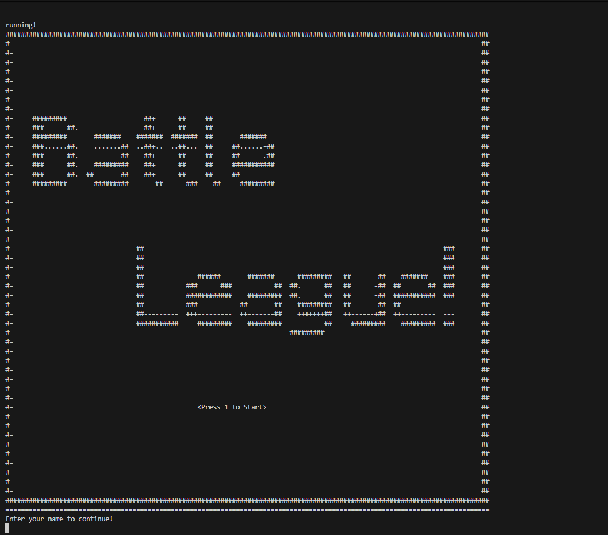

#### Class Selection
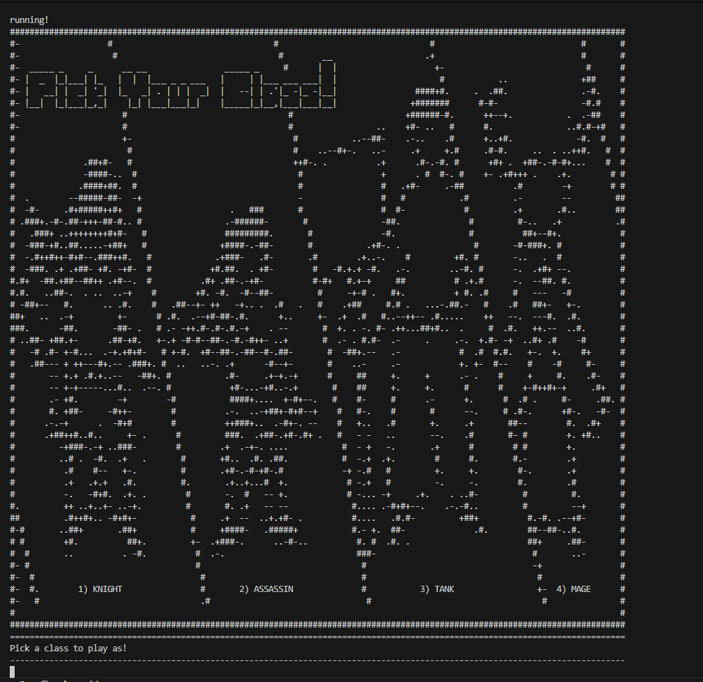

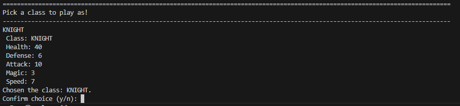

#### Enemy Encounter
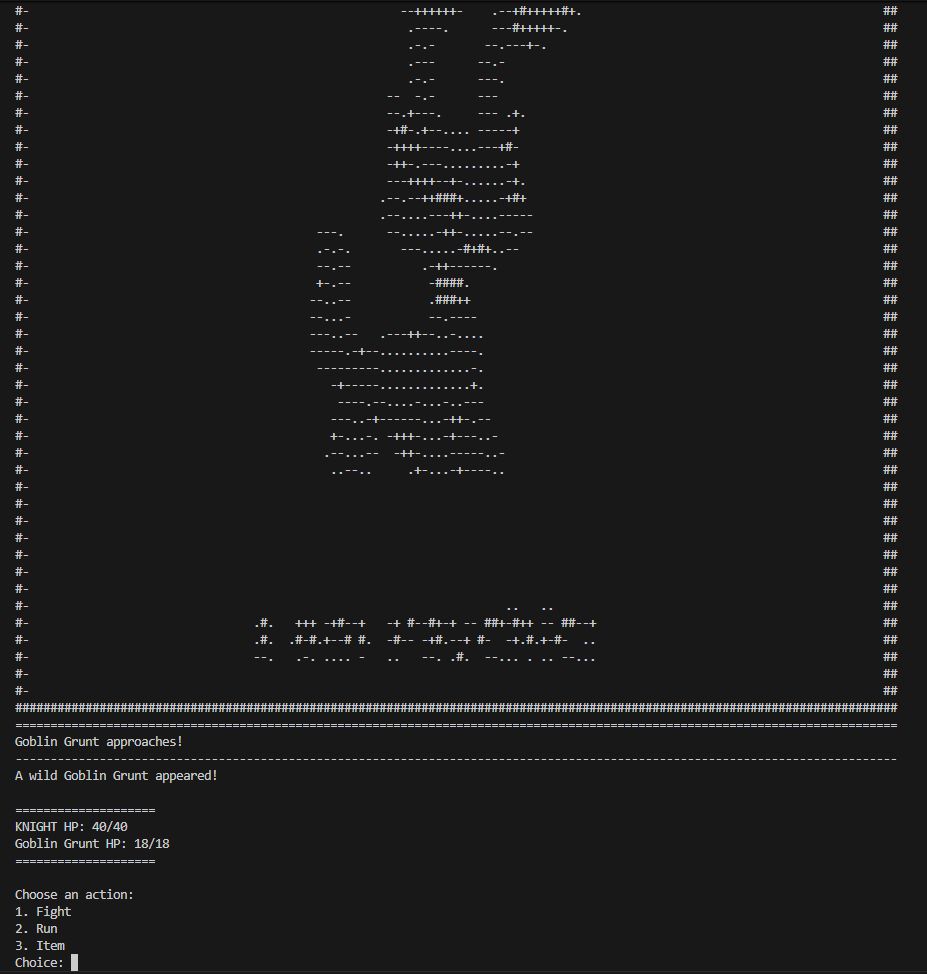

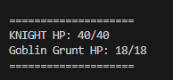

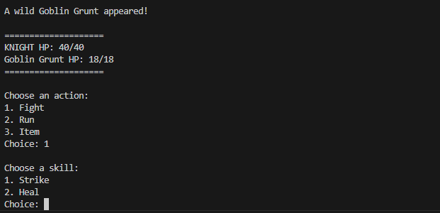

#### Area Entrance

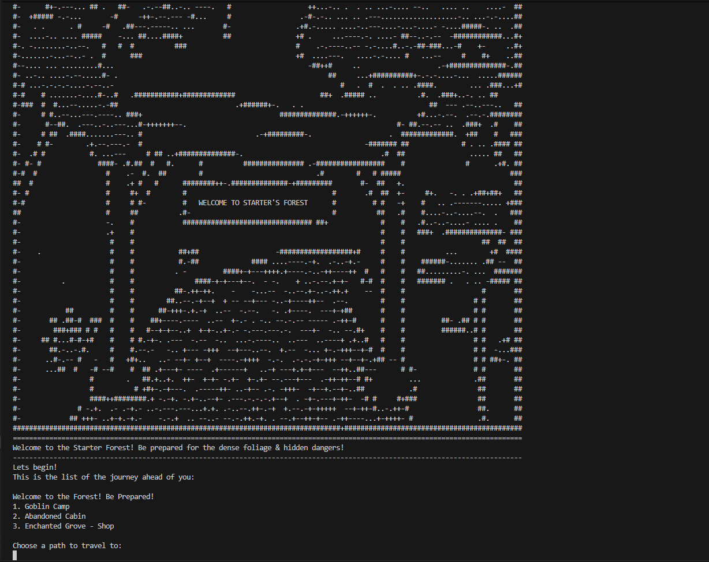

 ## Installation/Usage
1. Press the "code" button and download the zip file or clone the repository in your IDE of choice
2. Extract the zip file and place it in your IDE of choice (if applicable)
3. Open a terminal and navigate to the directory (mainFolder) inside your terminal and run the following:
 - $ cmake .
 - $ make
 - $ ./BattleLeague
 ## Testing
We tested this project by creating test files for each of the major components. Our Biome_test.cpp file contains tests that use the functionality, of our player classes, enemy classes, and pathways classes which successfully tested each implementation. We also had a seperate test for Screen Display classes. These test how the terminal will output information to the user during the game and in the start up. We used the google test subdirectory for all our tests and it worked well for the code we produced. Once there was a playable version of the game, we tested through repetitive play and picked different options to make sure that the game was working on all ends.
